# Smart Receipt AI

A production-ready Flutter app for intelligent receipt capture, Malaysian bank statement import, and tax-grade expense tracking — built with on-device OCR, LLM extraction, and AES-256 encrypted local storage.

> **Built for iOS & Android.** Optimized for Malaysian receipts, TNG eWallet, Maybank, CIMB, and Public Bank statements.

---

## App Screenshots

### Authentication & Receipt Management

<p align="center">
  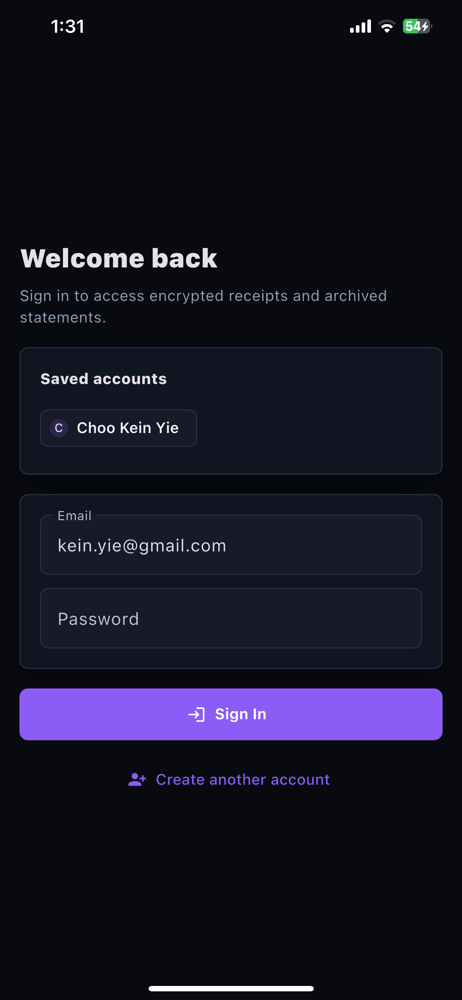
  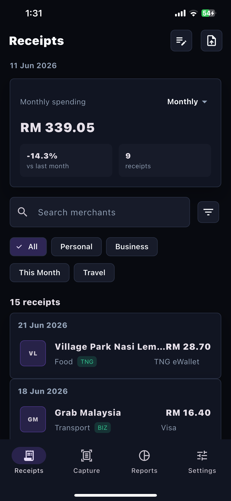
  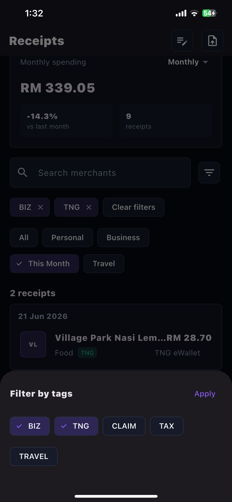
</p>

### Intelligent Receipt Capture

<p align="center">
  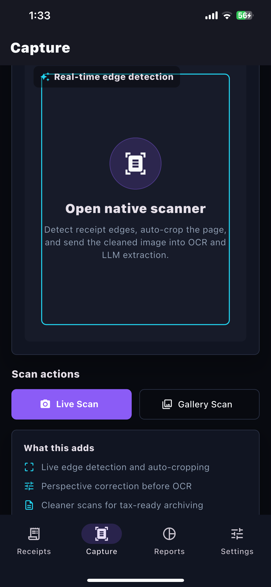
  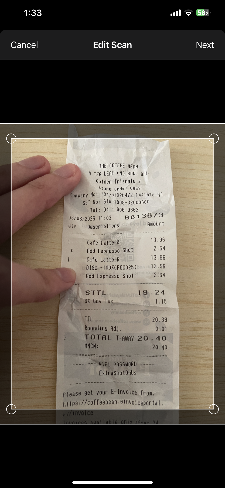
  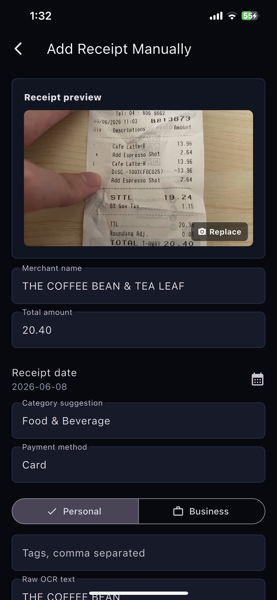
</p>

### Bank Statement Import

<p align="center">
  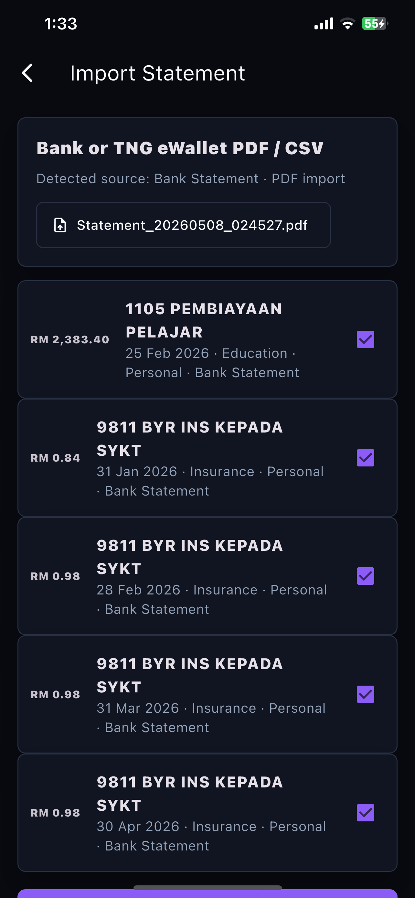
</p>

### Spending Analytics & Export

<p align="center">
  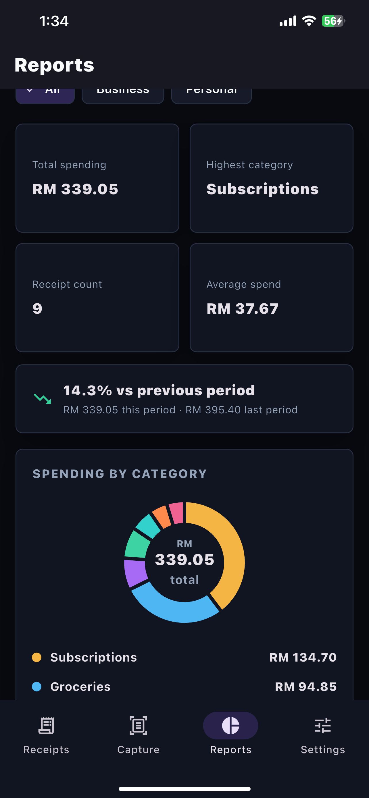
  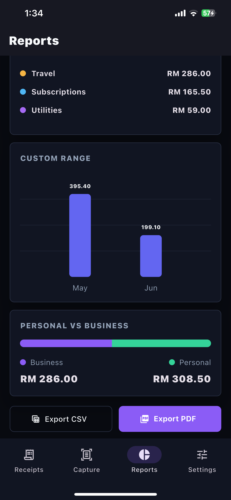
</p>

### Security & Data Integrity

<p align="center">
  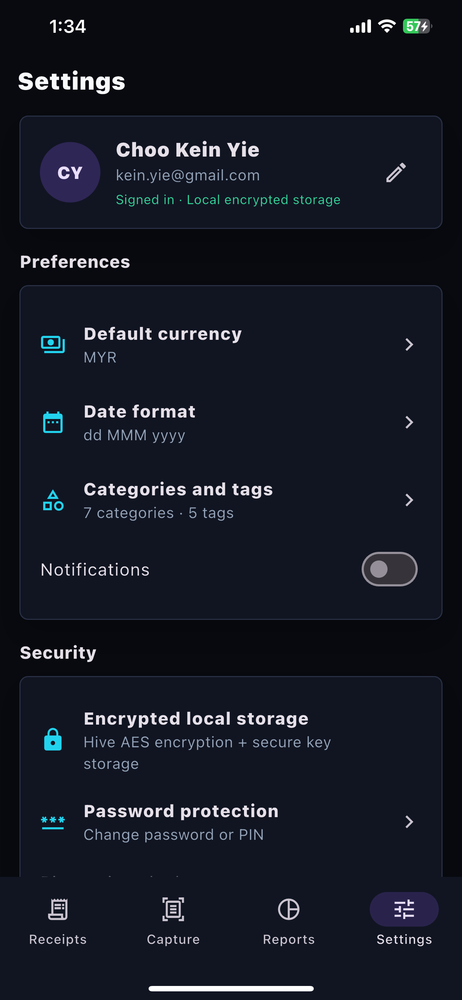
  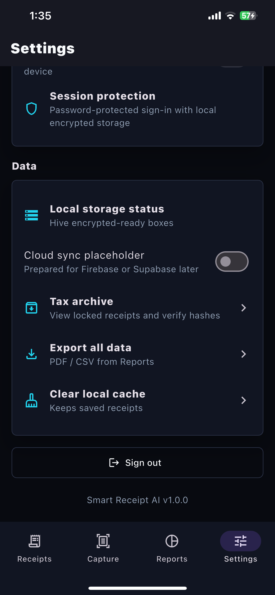
</p>

---

## What It Does

1. **Scan any receipt** — Live edge detection auto-crops and perspective-corrects before running on-device OCR (Google ML Kit). An LLM (OpenRouter) extracts merchant, amount, date, and line items; a local heuristic parser guarantees offline fallback.

2. **Import bank statements** — Drag-and-drop PDF/CSV from Malaysian banks. Regex-based parsers handle CR/DR sign conventions, multi-line descriptions, and cross-import deduplication. Statement transactions link back to scanned receipts.

3. **Track & report** — Categorize as Personal or Business. Filter by tags, date range, or type. Export tax-ready CSV/PDF reports with full SHA-256 hashes for audit trails.

4. **Lock & verify** — Archive receipts with SHA-256 integrity checks (includes image + item-level data). Bulk lock/unlock and hash verification in the Tax Archive.

---

## Technical Highlights

| Area | Implementation |
|------|----------------|
| **State Management** | Riverpod with derived `Provider` chains for reactive filtering, search, and report aggregation |
| **Local Storage** | Hive with AES-256 encryption; encryption keys stored via `flutter_secure_storage`; per-account receipt isolation |
| **Authentication** | SHA-256 password hashing + optional biometric unlock (`local_auth`) |
| **OCR Pipeline** | `google_mlkit_text_recognition` → OpenRouter LLM JSON extraction → local regex fallback → editable line-item reconciliation |
| **Edge Detection** | Native iOS scanner (`flutter_edge_detection` / WeScan) with Swift 5.9 compatibility patches for Xcode 15+ |
| **PDF Parsing** | Custom regex engine for TNG, Maybank, CIMB, and Public Bank statement formats; CR/DR amount normalization |
| **Data Integrity** | SHA-256 receipt hashes computed over metadata + line items + archived image; tamper detection in unit tests |
| **Charts & Reports** | `fl_chart` donut + adaptive bar charts (daily buckets ≤31 days, monthly otherwise); trend indicators with MoM % change |
| **Testing** | 18 unit tests covering amount parsing, regex matching, hash verification, and export formatting |

---

## Architecture Snapshot

```
lib/
├── models/          # Receipt, ReceiptItem, ArchiveRecord, UserAccount
├── providers/       # Riverpod: auth, receipts, reports, archives
├── screens/         # Login, Receipts, Capture, Reports, Settings, Archive
├── services/        # OCR, LLM, PDF import, export (CSV/PDF), hash verification
├── widgets/         # Reusable cards, tiles, charts
└── main.dart
```

---

## Getting Started

```bash
# 1. Install dependencies
flutter pub get

# 2. iOS: apply compatibility patches (Xcode 15+ / iOS 13+)
cd ios && pod install && cd ..
./patches/apply_ios_patches.sh

# 3. Add API key
cp .env.example .env  # then add your OpenRouter key

# 4. Run
flutter run
```

### Running Tests

```bash
flutter test        # 18 unit tests, all passing
flutter analyze     # static analysis
```

### Build

```bash
flutter build ios      # release iOS
flutter build apk      # release Android
```

---

## Why This Project

This app was built to solve a real problem: Malaysian expense tracking apps don't handle local receipt formats or bank statement imports well. Rather than build a simple CRUD demo, we invested in:

- **Offline-first reliability** — Every AI feature has a deterministic fallback.
- **Production-grade security** — Encryption at rest, secure key storage, hash-based tamper detection.
- **Real-world data handling** — Malaysian bank statement formats, CR/DR sign conventions, multi-line descriptions.
- **Tax compliance** — Lock, verify, and export with integrity hashes — not just a feature list, but tested end-to-end.
